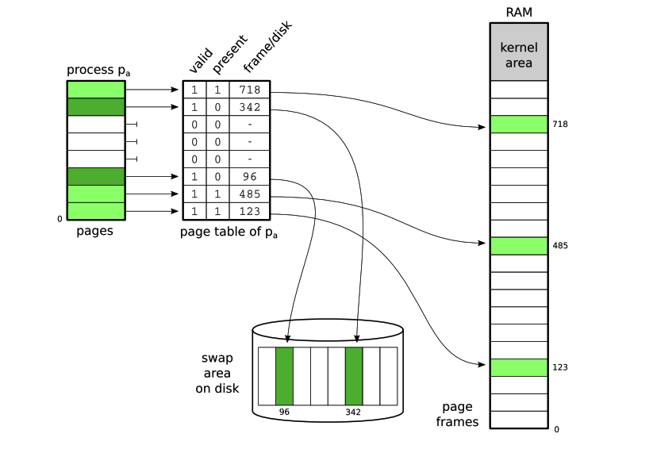

# Paginação em Disco

A ideia central da paginação em disco consiste em transferir páginas ociosas da memória RAM para uma área em disco, liberando memória para outras páginas. A transferência de páginas entre a memória e o disco é realizada pelo núcleo do sistema peracional. 
As páginas a retirar da memória são escolhidas por ele, de acordo com algoritmos de substituição de páginas. Quando um processo tentar acessar uma página que está em disco, o núcleo é alertado pela MMU (Memory Management Unit) e traz a página de volta à memória para poder ser acessada.
Para cada página transferida para o disco, a tabela de páginas do processo é ajustada: o flag de presença da página em RAM é desligado e a posição da página no
disco é registrada, ao invés do quadro. 

  

### Algoritmo FIFO
Um critério simples e factível a considerar para a escolha das páginas a substituir
poderia ser sua “idade”, ou seja, o tempo em que estão na memória. Assim, páginas mais
antigas podem ser removidas para dar lugar a novas páginas. Esse algoritmo é muito
simples de implementar: basta organizar as páginas em uma fila de números de páginas
com política FIFO (First In, First Out). Os números das páginas recém carregadas na
memória são registrados no final da lista, enquanto os números das próximas páginas a
substituir na memória são obtidos no início da lista.

### Algoritmo LRU
Uma aproximação implementável do algoritmo ótimo é proporcionada pelo
algoritmo LRU (Least Recently Used, menos recentemente usado). Neste algoritmo, a
escolha recai sobre as páginas que estão na memória há mais tempo sem ser acessadas.
Assim, páginas antigas e menos usadas são as escolhas preferenciais. Páginas antigas
mas de uso frequente não são penalizadas por este algoritmo, ao contrário do que
ocorre no algoritmo FIFO.

### Trabalho 
Implementar os algoritmos de troca de páginas - (1) FIFO, (2) LRU (qualquer versão) em um sistema que simule a alocação de páginas de processos na memória. O
objetivo do exercício é contar e comparar o número de “page faults” para cada algoritmo. A sequência
de páginas solicitadas pelos processos pode ser representada por uma “string de referência”, ou seja,
uma sequência de pares de números que representam um processo e uma página, respectivamente.  

 - Exemplo de string de referência: 1,0;1,1;2,0;1,1;2,1;3,0;1,3;...;0,0;  
Corresponde a sequência de referências à página 0 do processo 1, seguido da página 1 do processo 1, seguido da página 0 do
processo 2, página 1 do processo 1, página 1 do processo 2, página 0 do processo 3, etc. Página 0 do
processo 0 significa fim da string.  

- A saída esperada tem o seguinte formato: Page Faults: XXXXX

